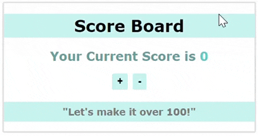

# Scoreboard App with React Context API (React)

This project demonstrates how to manage global state in React using the `useContext` hook. It’s a simple and interactive scoreboard that allows users to increase or decrease the score by 10 points, with dynamic content based on the score. By using React's Context API, we manage the score state centrally and make it accessible across different components.

## Features

- **Score management**: Increase or decrease the score using buttons.
- **Global state with Context API**: Manage the score across the app using `useContext` and `useState`.
- **Dynamic UI**: Display dynamic messages based on the current score, such as "Let's make it over 100!" and "Good job!" when the score exceeds 100.
- **Clean architecture**: Used separate components and context to keep the codebase organized.

## Getting Started

### Prerequisites

Before you begin, make sure you have the following installed:

- **Node.js**: Version 14 or higher.
- **npm** (Node Package Manager): Comes with Node.js.


## Preview
Here’s a preview of the expected behavior:



## How to Run the Project

To run this project locally on your computer, follow these steps:

## Getting Started
1. Clone the repository to your local machine:
  ```bash
   git clone <repository-url>
  ```
  2. Navigate to the project folder
  ```bash
   cd <directory-name>
  ```
  3. Install dependencies
  ```bash
   npm install
  ```
  4. Start the development server
   ```bash
   npm run dev
  ```
  5. Open your browser \
     The app will open in your default browser, typically at:
  ```bash
  Local: http://localhost:5173/

